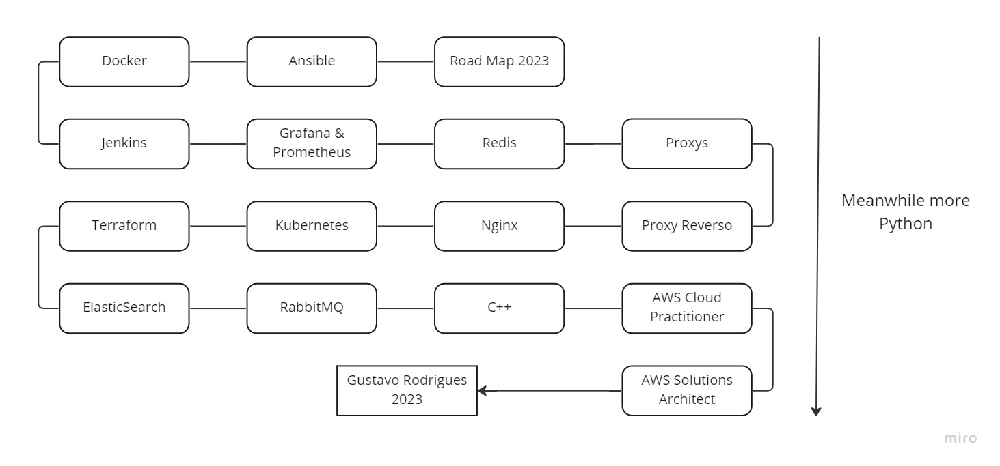

## Quais são minhas necessidades atuais

- ~~Preciso entender as aplicações com containers~~
    - [x]  Finalize seu curso de Docker
        - Docker Curso
            - [x]  Containers
            - [x]  Docker Compose
            - [x]  Projeto Digital Ocean
- Preciso dominar mais o jenkins para o meu trabalho
    - [x]  Adicione um curso de Jenkins a sua planilha de contas.
        - Jenkins Curso
            - [x]  Conceitos
            - [x]  Servidor Jenkins
            - [x]  Manage Jenkins
            - [x]  Slave
            - [x]  Working w/ Jenkins
            - [x]  Utilizando Pipelines
            - [x]  Notificando Status dos Builds
            - [x]  Jenkins Blue Ocean
            - [x]  Jenkins CLI
            - [x]  Jenkins em outras plataformas

- Preciso compreender o prometheus e grafana como um todo
    - [x]  Adicione também um curso de prometheus e grafana

## Vontades e Curiosidades

- Como o Python funciona, nas entrelinhas
  - [ ] Concorrência e Paralelismo
    - [x] Threading
    - [x] MultiThreading
    - [ ] Programação Assíncrona
  - [ ] APIs
    - [ ] FastApi
  - [ ] Testes Unitários
  

- Preciso de uma linguagem de programação mais objetiva - C++ ou Rust
    - Escolhi aprender o básico de C++, devido ao grande interesse em programação competitiva
        - [x]  Instalação e Compilação
        - [x]  Lógica de Programação
    - Agora meus estudos em Golang serão iniciados, foi a linguagem que escolhi para adaptar meus conhecimentos fora o Python que já "domino" e conheço.
        - [ ]  Lógica de Programação

- Preciso melhorar meus aprendizados de DevOps
    - Carreira
        - [ ]  Construir uma aplicação com Nginx com Proxy Reverso
            - Requisitos:
                - Compreenda proxys e proxys reversos.
        - [ ]  Orquestre containers com Kubernetes
        - [ ]  Utilize chaves de cache com Redis.
        - [ ]  Aprenda provisionamento de infraestrutura com Terraform
            - Requisitos:
                - Neste nível já esteja cursando algum curso preparatório para uma das certificações AWS
        - [ ]  Compreenda a funcionalidade de Banco de Dados SQL c/ MySQL
        - [ ]  Compreenda a funcionalidade de Banco de Dados NoSQL c/ MongoDB
        - [ ]  Aprenda engenharias de Busca com ElasticSearch
        - [ ]  Entenda sobre Message Brokers com RabbitMQ
        - [ ]  Agora que seus objetivos estão concluídos, comece no front com JavaScript
        - [ ]  Frameworks? Sim, Node.
        - [ ]  Mais sobre JS? Olá Express.JS e Next.JS
        - [ ]  Aprenda sobre Mobile, chegou a vez do React

## Objetivos (Certificações)

- AWS - Cloud Foundations
    - Requisitos
        - [ ]  A prova atualmente custa $100 equivalente a R$550
        - [ ]  Comece um curso preparatório para a mesma.
        
        Esta certificação é interessante para entender todos os conceitos da AWS, seja preço, metodologia ou logística.
        
- AWS - Solutions Architect
    - Requisitos
        - [ ]  A prova atualmente custa $150 equivalente a R$850
        - [ ]  Necessário a certificação da cloud foundations
        - [ ]  Interessante compreender como criar e escolher as melhores soluções. Faça um curso preparatório.

## RoadMap

Vale a pena lembrar que embora, eu tenha desejo em aprender outras linguagens, meu foco continuará sendo python.

> Desde que começei na área vi que estes são os serviços mais usados. Então decidi que queria aprender estes serviços (e microserviços). Meu objetivo é poder arquitetar, construir, realizar manutenções e implantar estes serviços nas minhas futuras empresas ou atuais. 
> Por mais que eu ame desenvolver, amo mais ainda entender como os serviços se conectam e funcionam, como eles podem conversar e etc. Isso foi o grande motivo que me cativou desde o início.
